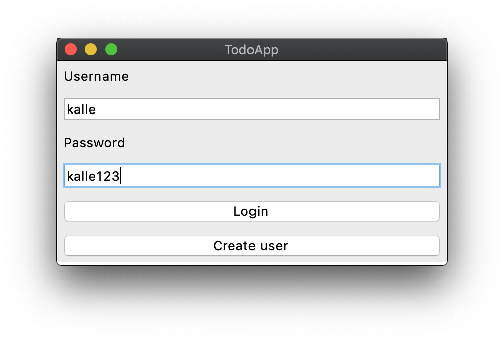
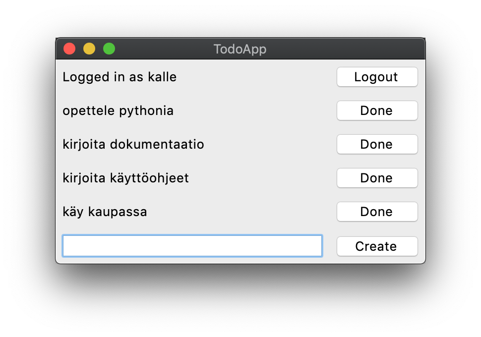

# Käyttöohje

Lataa projektin viimeisimmän [releasen](https://github.com/ohjelmistotekniikka-hy/python-todo-app/releases) lähdekoodi valitsemalla _Assets_-osion alta _Source code_.

## Konfigurointi

Tallennukseen käytettävien tiedostojen nimiä voi halutessaan konfiguroida käynnistyshakemistossa _.env_-tiedostossa. Tiedostot luodaan automaattisesti _data_-hakemistoon, jos niitä ei siellä vielä ole. Tiedoston muoto on seuraava:

```
TODOS_FILENAME=todos.csv
DATABASE_FILENAME=database.sqlite
```

## Ohjelman käynnistäminen

Ennen ohjelman käynnistämistä, asenna riippuvuudet komennolla:

```bash
python3 -m poetry install
```

Jonka jälkeen suorita alustustoimenpiteet komennolla:

```bash
python3 -m poetry run invoke build
```

Nyt ohjelman voi käynnistää komennolla:

```
python3 -m poetry run invoke start
```

## Kirjautuminen

Sovellus käynnistyy kirjautumisnäkymään:



Kirjautuminen onnistuu kirjoittamalla olemassaoleva käyttäjätunnus sekä syötekenttään ja painamalla "Login"-painiketta.

## Uuden käyttäjän luominen

Kirjautumisnäkymästä on mahdollista siirtyä uuden käyttäjän luomisnäkymään panikkeella "Create user".

Uusi käyttäjä luodaan syöttämällä tiedot syötekenttiin ja painamalla "Create"-painiketta:


Jos käyttäjän luominen onnistuu, siirrytään siirrytään käyttäjän tekemättömät työt listaavaan näkymään.

## Todojen luominen ja tehdyksi merkkaaminen

Onnistuneen kirjautumisen myötä siirrytään käyttäjän tekemättömät työt listaavaan näkymään:



Näkymä mahdollistaa olemassaolevien todojen merkkaamisen tehdyksi painikkeella "Done" sekä uusien todojen luomisen kirjoittamalla syötekenttään tehtävän kuvauksen ja painamalla "Create"-painiketta.

Klikkaamalla näkymän oikean ylänurkan painiketta "Logout" painamalla käyttäjä kirjautuu ulos sovelluksesta ja sovellus palaa takaisin kirjaantumisnäkymään.
